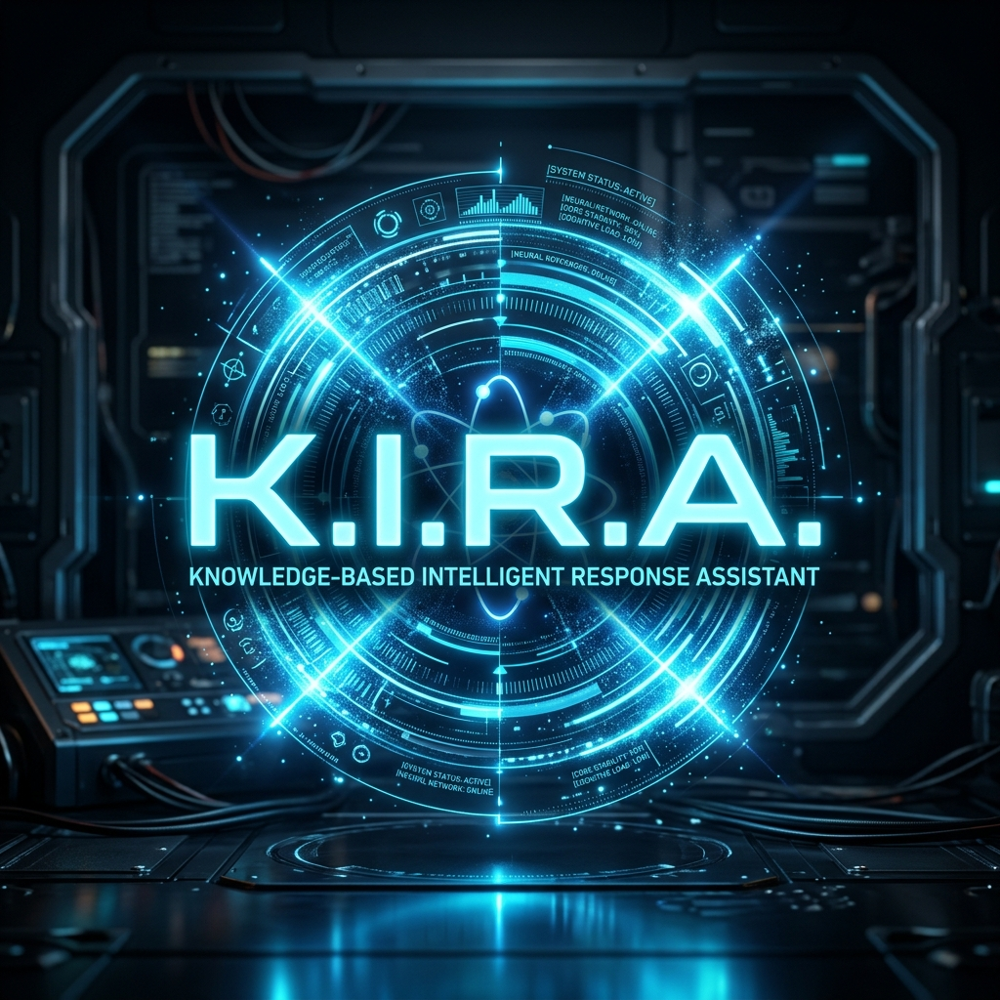
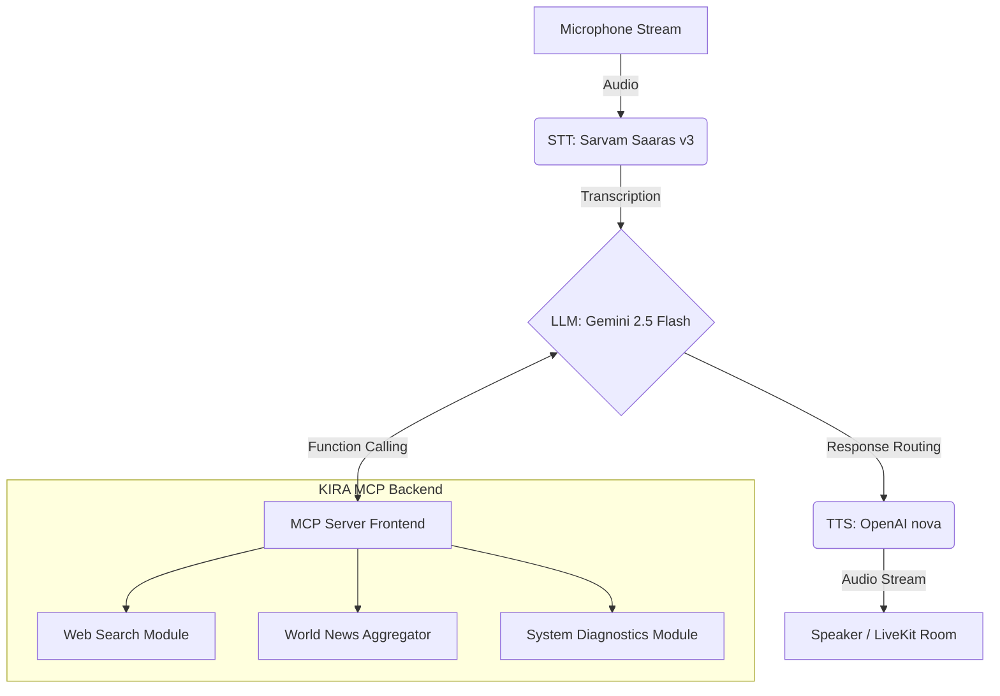

<div align="center">
  
  <h1>K.I.R.A</h1>
  <p><strong>Knowledge-based Intelligent Response Assistant</strong></p>


  <p><i>State-of-the-Art Real-Time Voice Assistant Powered by the Model Context Protocol (MCP) and LiveKit.</i></p>
</div>

---

## 📖 Table of Contents
- [About the Project](#about-the-project)
- [Architecture](#architecture-overview)
- [Features](#key-features)
- [Directory Structure](#repository-structure)
- [Getting Started](#getting-started)
- [CLI Reference](#cli-commands)
- [Configuration](#environment-variables)
- [Advanced Usage](#advanced-usage)
- [Tech Stack](#tech-stack)
- [License](#license)

---

## 🤖 About the Project

**K.I.R.A** (Knowledge-based Intelligent Response Assistant) is a highly capable voice AI system built for real-time conversation and tool execution. It utilizes an extensible dual-component architectural design:

1. **The Intelligence Engine (MCP Server)**: An extensible backend ([FastMCP](https://github.com/jlowin/fastmcp)) that securely exposes diagnostic telemetry, web interactions, and custom utility tools over Server-Sent Events (SSE).
2. **The Voice Pipeline (Voice Agent)**: A low-latency conversational routing pipeline ([LiveKit](https://github.com/livekit/agents)) that processes microphone input, leverages LLM reasoning (Gemini 2.5 Flash), and streams highly expressive text-to-speech outputs dynamically.

---

## 🏗 Architecture Overview



*The Voice Agent communicates with the MCP Server securely over an SSE channel at `http://127.0.0.1:8000/sse`.*

---

## ✨ Key Features

- **Blazing Fast Conversational Engine**: Designed for highly responsive voice interactions with zero-latency streaming.
- **Robust Tool Execution Ecosystem**: Securely extend the assistant's capabilities through standardized modular MCP scripts.
- **Dynamic Provider Switching**: Instantly switch between leading models (Gemini, OpenAI, Sarvam, Deepgram) without rewriting core logic.
- **Cross-Platform Compatibility**: Supports native execution, including automated host-resolution for Windows Subsystem for Linux (WSL).

---

## 📂 Repository Structure

```text
KIRA/
├── server.py           # Entry Point: Initializes the FastMCP Server (SSE on port 8000)
├── agent_kira.py       # Entry Point: Initializes the LiveKit Voice Agent Pipeline
├── pyproject.toml      # Project Metadata & Dependency Definitions
├── .env.example        # Environment Variable Scaffold
│
└── kira/               # Core Framework Package
    ├── config.py       # Secure API key loading & application configurations
    ├── tools/          # Extensible MCP Tool Registry
    │   ├── web.py      # Implementations for dynamic web scraping & API fetching
    │   ├── system.py   # Implementations for local telemetry & metric extraction
    │   └── utils.py    # Formatting & structural utility functions
    ├── prompts/        # Systemic prompt templating registry
    └── resources/      # Static / Dynamic resources exposed over MCP
```

---

## 🚀 Getting Started

Follow these instructions to get a local copy up and running in minutes.

### 1. System Prerequisites

Verify your system meets the following criteria before installation:
- **Python** `v3.11` or higher
- **[uv](https://github.com/astral-sh/uv)** package manager: 
  > `pip install uv` or `curl -Lsf https://astral.sh/uv/install.sh | sh`
- **[LiveKit Cloud](https://cloud.livekit.io)** project (*The free tier is sufficient for deployment.*)

### 2. Installation

Clone the repository and install dependency requirements effortlessly:

```bash
git clone https://github.com/Alinshan/KIRA.git
cd KIRA
uv sync
```

### 3. Environment Configuration

Clone the configuration template and safely inject your API keys:

```bash
cp .env.example .env
```
*(Refer to the [Environment Variables](#environment-variables) section for configuration options).*

### 4. Running the System

Running **K.I.R.A** requires initializing both the intelligence backend and the voice pipeline concurrently via two terminal sessions.

**Terminal 1 — Intelligence Backend (Start Here)**
```bash
python -m uv run kira
```

**Terminal 2 — Voice Pipeline**
```bash
python -m uv run python agent_kira.py dev
```
*To interact directly with K.I.R.A, navigate to the [LiveKit Agents Playground](https://agents-playground.livekit.io) and establish a room connection.*

---

## ⚙️ CLI Commands

| Launch Command | Execution Path | Description |
|----------------|----------------|-------------|
| `python -m uv run kira` | `server.py → main()` | Launches the **FastMCP backend**. Handles all tool registrations, resource allocations, and prompt schemas for LLM access. |
| `python -m uv run python agent_kira.py dev` | `agent_kira.py → dev()` | Launches the **LiveKit pipeline**. Orchestrates STT, LLM, and TTS module threading while resolving MCP SSE queries. |

---

## 🔐 Environment Variables

Ensure `.env` matches the criteria below:

| Variable | Protocol | Service Origin |
|----------|----------|----------------|
| `LIVEKIT_URL` | **Required** | [LiveKit Console Project URI](https://cloud.livekit.io) |
| `LIVEKIT_API_KEY` | **Required** | LiveKit Platform Authentication |
| `LIVEKIT_API_SECRET` | **Required** | LiveKit Platform Authentication |
| `SARVAM_API_KEY` | **Required** | Base STT Provider API ([dashboard.sarvam.ai](https://dashboard.sarvam.ai)) |
| `OPENAI_API_KEY` | **Required** | Base TTS Provider API ([platform.openai.com](https://platform.openai.com/api-keys)) |
| `GOOGLE_API_KEY` | **Required** | Base LLM Provider API ([aistudio.google.com](https://aistudio.google.com/projects)) |
| `GROQ_API_KEY` | Optional | Low-Latency LLM Fallback ([console.groq.com](https://console.groq.com)) |
| `DEEPGRAM_API_KEY` | Optional | High-Fidelity STT Alternative ([console.deepgram.com](https://console.deepgram.com)) |
| `SUPABASE_URL` | Optional | Database Engine Endpoint ([supabase.com](https://supabase.com)) |
| `SUPABASE_API_KEY` | Optional | Database Authentication |

---

## 🛠 Advanced Usage

### Dynamic Engine Switching
Modify underlying pipeline algorithms rapidly by updating global constants in `agent_kira.py`:

```python
STT_PROVIDER = "sarvam"   # Supported: "sarvam" | "whisper"
LLM_PROVIDER = "gemini"   # Supported: "gemini" | "openai"
TTS_PROVIDER = "openai"   # Supported: "openai" | "sarvam"
```

### Developing New MCP Tools
Extend K.I.R.A's native capabilities by creating new MCP tools:
1. Initialize a new logic module in `kira/tools/` (e.g. `jira.py`).
2. Utilize the `@mcp.tool()` decorator on execution logic and wrap it within a `register(mcp)` function.
3. Import your function in `kira/tools/__init__.py`. 

The MCP server will automatically document and expose your tool to the LLM on reboot.

---

## 🧩 Tech Stack

Modern. Fast. Scalable.

- **[FastMCP](https://github.com/jlowin/fastmcp)** — Highly scalable Model Context Protocol backbone
- **[LiveKit Agents](https://github.com/livekit/agents)** — Low-latency WebRTC routing
- **[Sarvam Saaras v3](https://sarvam.ai/)** — Context-aware, diverse-accent optimized STT
- **[Google Gemini Flash](https://deepmind.google/technologies/gemini/)** — Advanced multimodal LLM engine
- **OpenAI TTS** — Expressive human-like voice synthesis models
- **[uv](https://github.com/astral-sh/uv)** — Impossibly fast Python deployment and packaging 

---

## ⚖️ License

Distributed under the **MIT** License. See the `LICENSE` file in the root directory for more information.

<p align="right"><a href="#kira">⬆️ Back to Top</a></p>
